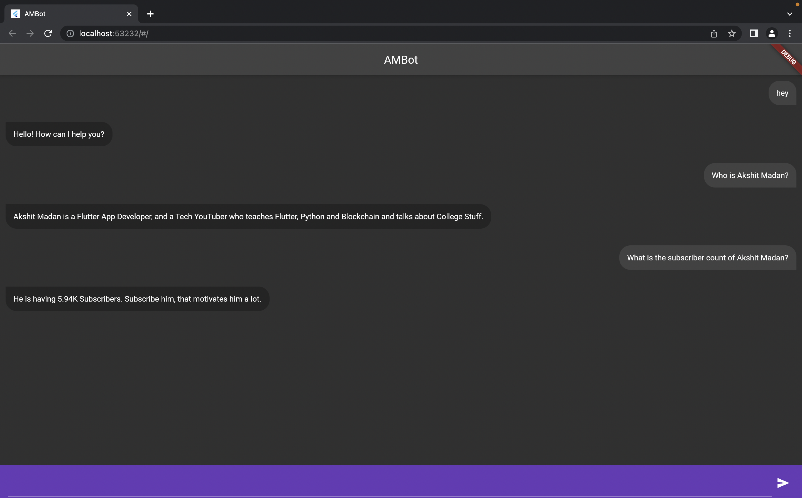

# Readme
1. Go to https://dialogflow.cloud.google.com/ and signin with a Google Account. 
2. Create an agent. 
3. You will get two default intents, for "greeting" and "did not understand".
4. Add your own intents. 
5. Now go to settings and find the project id. 
6. Find the same project in cloud console. 
7. Add a service account and create a json key and download it.
8. Put this key in assets folder of Flutter Project. 

# That's it!
